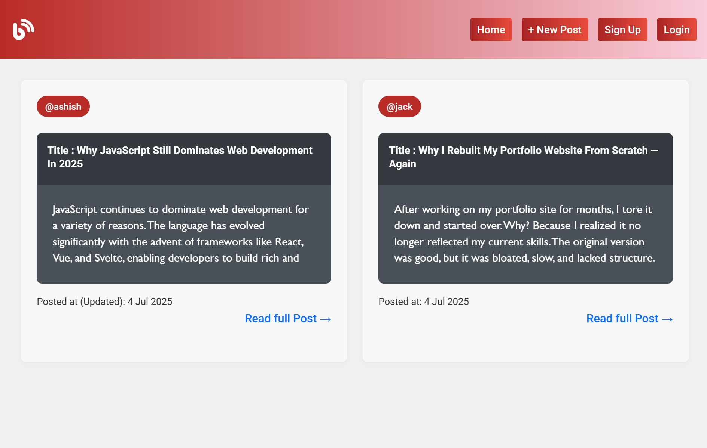
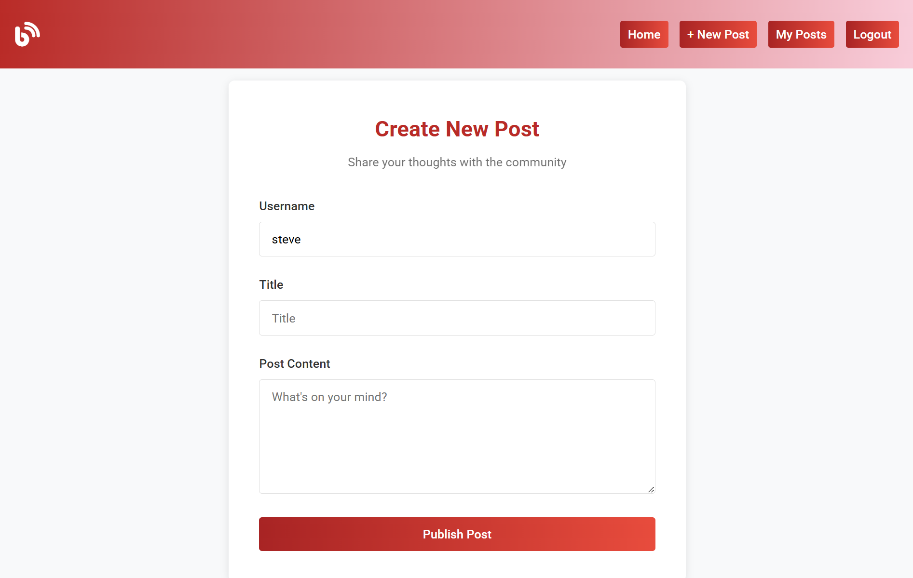
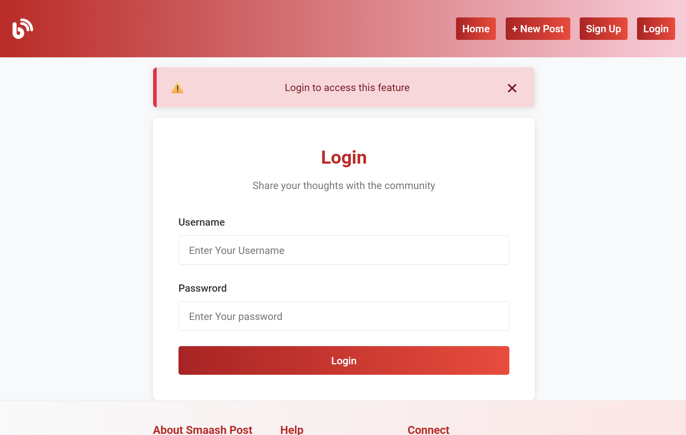
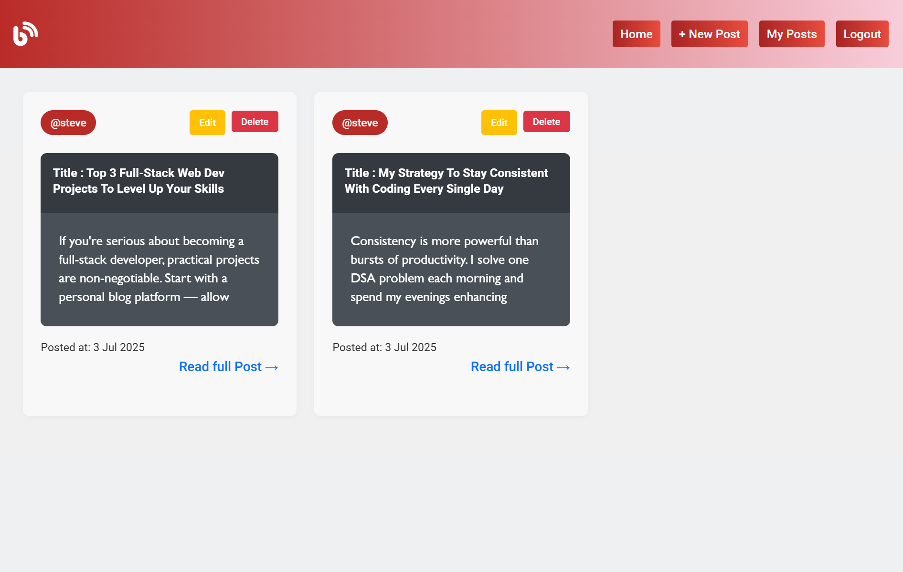

# 📘 Smaash Posts

A full-stack Quora-style blogging web application where users can **sign up, log in, write blog posts, edit/delete their own posts**, and read others' blogs. This project is built with **Node.js**, **Express**, **MongoDB**, and **EJS**, and includes **authentication, validation, and flash messaging**.

---

## 🚀 Features

- 📝 User can **write blog-style posts** (title + content)
- 👤 **Authentication system** using Passport.js
- 🧠 Server-side **data validation** using Joi
- 📌 **Flash messages** for success and error feedback
- 🧾 **CRUD operations** for posts
- 🌐 Responsive & mobile-friendly design (media queries + animations)
- 🔒 Protected routes (users must be logged in to create/edit posts)
- 💾 MongoDB + Mongoose for data storage
- 🎨 Fully themed UI with gradient navbar and minimalist cards

---

## 🛠️ Tech Stack

| Category      | Tech |
|---------------|------|
| **Frontend**  | HTML, CSS, EJS Templates |
| **Backend**   | Node.js, Express.js |
| **Database**  | MongoDB with Mongoose |
| **Auth**      | Passport.js (local strategy), express-session |
| **Validation**| Joi |
| **Flash**     | connect-flash |
| **Templating**| ejs-mate |
| **Deployment**| render |

---

## 📁 Project Structure

```
Smaash-posts/
├── controllers/  
├── public/              # Static assets (CSS, JS, images)
├── routers/             # Route files (posts & users)
├── Schema/              # Mongoose schemas
├── utils/               # Custom Express errors, Joi schema, wrapAsync
├── views/               # EJS view templates
├── app.js               # Main server file
├── .env                 # Environment variables
├── package.json
└── README.md
```

---

## 🔐 Authentication

- Uses `passport-local` with `passport-local-mongoose`
- Passwords are hashed and salted automatically
- Only authenticated users can:
  - Write a post
  - Edit/Delete their own posts
  - View "My Posts" section

---

## 🧪 Validation

- **Joi** is used for both post and user validation
- Validates:
  - Title: min 3, max 100 characters
  - Content: min 10 characters
  - Username & email presence

---

## ⚙️ Installation and Running Locally

### 1. **Clone the repository**
```bash
git clone https://github.com/yourusername/smaash-posts.git
cd smaash-posts
```

### 2. **Install dependencies**
```bash
npm install
```

### 3. **Setup environment variables**
Create a `.env` file in the root directory:
```env
DBUrl=your_mongo_connection_string
SECRET=your_secret_key
```

### 4. **Start the development server**
```bash
nodemon app.js
# or
node app.js
```

The application will be available at `http://localhost:8080`

---

## 📋 Prerequisites

- Node.js (v14 or higher)
- MongoDB database
- npm or yarn package manager

---

## 🖼️ Screenshots

### 🏠 Home Page


### 📝 Post Creation


### 👤 User 



---

## 🌐 API Endpoints

### Authentication Routes
- `GET /signup` - Show registration form
- `POST /signup` - Create new user account
- `GET /login` - Show login form
- `POST /login` - Authenticate user
- `POST /logout` - Log out user

### Post Routes
- `GET /` - Display all posts
- `GET /posts/new` - Show create post form (protected)
- `POST /posts` - Create new post (protected)
- `GET /posts/:id` - Show specific post
- `GET /posts/:id/edit` - Show edit form (protected)
- `PATCH /posts` - Update post (protected)
- `DELETE /posts/:id` - Delete post (protected)

---


## ✍️ Contribution Guide

If you'd like to contribute:

1. Fork the repo
2. Create your feature branch (`git checkout -b feature/some-feature`)
3. Commit your changes (`git commit -m 'Add feature'`)
4. Push to the branch (`git push origin feature/some-feature`)
5. Open a Pull Request

---

## 📌 Future Improvements

- 👍 Like & Comment system
- 🔍 Search functionality
- 🏷️ Post categories/tags
- 📱 Progressive Web App (PWA)
- 📬 Email verification
- 🔔 Real-time notifications
- 📊 User analytics dashboard
- 🖼️ Image upload support
- 🌙 Dark mode toggle

---


## 📜 License

This project is open-source and available under the [MIT License](LICENSE).

---

## 🙌 Acknowledgments

- Thanks to the Node.js, MongoDB, Express, and EJS communities for their awesome docs and libraries
- Inspired by Quora's clean and minimalist design
- Special thanks to all contributors

---

## 💬 Contact

**Author**: Ashish Sinsinwal
- GitHub: [Ashish Sinsinwal](https://github.com/AshishSinsinwal)
- LinkedIn: [Ashish Sinsinwal](https://www.linkedin.com/in/ashish-sinsinwal-a31b48318/)


---


<div align="center">
  <p>Made with ❤️ by Ashish Sinsinwal </p>
  <p>⭐ Star this repo if you found it helpful!</p>
</div>